This document shows how the principal UnifyEMPI paths work as implemented. The diagrams
distinguish synchronous automation, message-driven processing, human-governed actions,
and work that is deliberately not performed in the background.

For definitions of source Patients, canonical Patients, enterprise `Person` links,
tenants, HMAC and blocking tags, see
[identity model and frequently asked questions](/UnifyEMPI/concepts/identity-model/).
For the exact normalisation, blocking, scoring, certainty and routing rules, see the
normative [matching and blocking rules](/UnifyEMPI/matching/rules/).
The operator procedures are in
[re-indexing and population reconciliation](/UnifyEMPI/guides/maintenance/) and
[matching assurance and calibration](/UnifyEMPI/guides/matching-assurance/).

## Processing model at a glance

| Path | Trigger and timing | Automated? | Changes the registry? |
| --- | --- | --- | --- |
| New source `Patient` | Real-time, inside the FHIR create request | Yes: validation, candidate lookup, scoring, survivorship and routing | Yes |
| Existing source `Patient` update | Real-time, inside the FHIR update request | Yes: validation and refresh of its existing cluster | Yes; it does not currently run a cross-cluster duplicate recheck |
| HL7v2 ADT | Message-driven and synchronous for each MLLP frame | Yes: parse, deduplicate, ingest and match before ACK | Yes |
| FHIR `$match` | Real-time, on demand | Yes: bounded lookup and scoring | No |
| Duplicate workbench search | Real-time, started by an authorised user | Yes: bounded lookup and scoring | No, until the user opens a review |
| Merge or split decision | Real-time, started by an authorised reviewer | Evidence and concurrency checks are automatic; the decision is human | Yes, atomically after the approval threshold is met |
| Online blocking-index rebuild | Manual administrative request, processed in leased batches | Yes: validate overlap, checkpoint and re-index | Yes: canonical blocking tags, job Task and audit |
| Population reconciliation | Manual or per-tenant schedule, processed in leased batches | Yes: import, rebuild and bounded rematch | Yes: snapshots, derived state, review Tasks and audit; never automatic merges |
| Ground-truth evaluation | Administrative request or portal workbench | Yes: load referenced records, score and aggregate | No patient or link changes; summary audit only |
| Fellegi–Sunter calibration | Administrative request or portal workbench | Yes: stratified fit and held-out report | No model activation or patient changes; summary audit only |

FHIR ingest is request-driven; MLLP is message-driven but processed synchronously before
the sender receives an acknowledgement. Candidate blocking keeps those online paths
bounded. A separate maintenance worker deliberately pages the population for controlled,
resumable operations; it does not turn a broad query into a request-path fallback or
perform an all-pairs nested comparison. There is no internal asynchronous event bus.

## Runtime overview

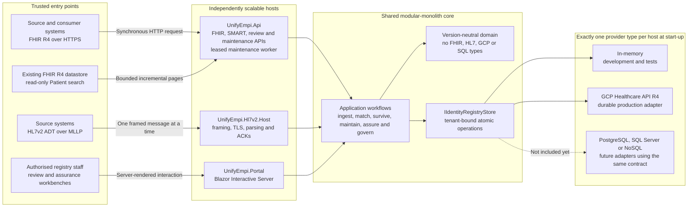

Each production host points at the same durable registry provider. The API and MLLP
processes can therefore scale independently without splitting the identity decision
logic into distributed services.

## Duplicate detection and matching

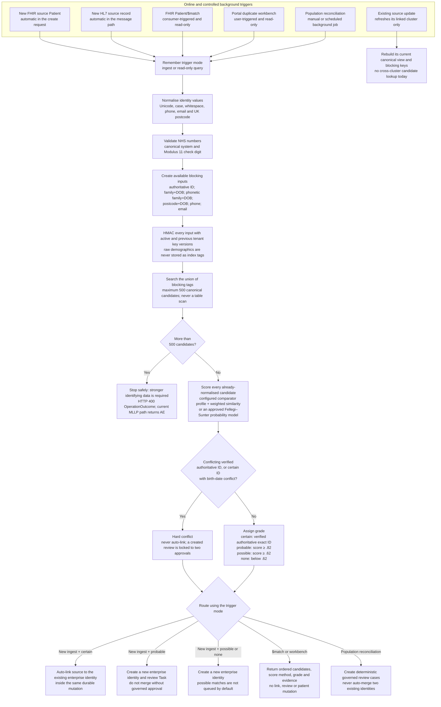

The score is explainable: every result carries field-level comparator, similarity and
contribution. In the default weighted profile, contribution is similarity multiplied by
weight. In a calibrated Fellegi–Sunter profile, it is the field log-likelihood
contribution and the final score is a probability. Missing data contributes no
evidence; it is never interpreted as equality. A `certain` grade is not merely a high
score—it requires a verified tenant-authoritative exact identifier and no hard conflict.

The diagram shows the default `uk-default-v1` profile. Named blocking rounds, field
weights, authoritative identifier systems and bounded limits are configurable per
tenant at deployment; their exact semantics and change-control requirements are defined
in [matching and blocking rules](/UnifyEMPI/matching/rules/).

The current trigger-specific outcomes are:

- a new source record is checked automatically before its durable commit;
- an existing source-local record remains attached to its enterprise identity and is
  not compared with other clusters during that update;
- `$match` and the workbench always run the bounded pipeline on demand but have no
  persistence side effects; and
- a probable ingest match creates a review, while a possible ingest match does not; and
- reconciliation pages canonical identities sequentially and runs the same bounded
  blocking lookup for each identity, creating deterministic review cases rather than
  merging automatically.

This separation keeps ordinary ingest latency predictable while making historical
rechecks explicit, observable and resumable. Population iteration is permitted only in
the background maintenance path. Candidate comparison remains bounded by blocking keys
and the configured maximum.

## Online re-index and population reconciliation

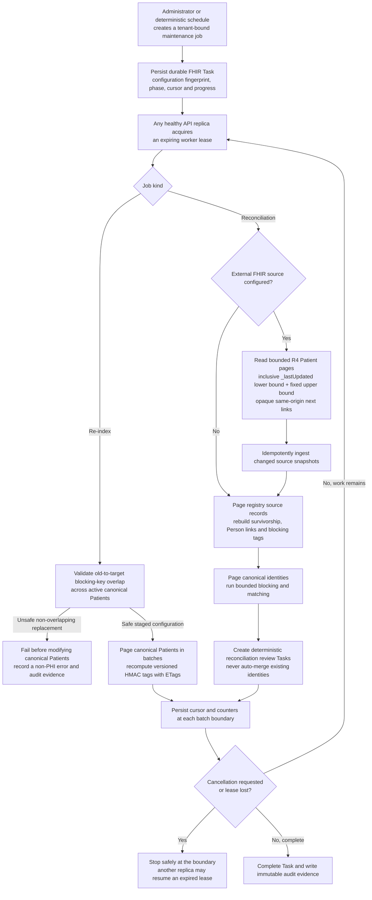

Jobs are idempotent and tenant-scoped. A fingerprint binds the run to the matching
rules, source trust and blocking secrets present when it started, so a worker cannot
silently continue after configuration changes. Online re-indexing requires a staged
union of old and new blocking inputs. Reconciliation may import an incremental snapshot
from an existing FHIR R4 datastore, but that integration is deliberately read-only:
UnifyEMPI does not write back, infer deletion from absence, or follow a paging URL to a
different origin.

See the [maintenance guide](/UnifyEMPI/guides/maintenance/) for APIs, scheduling,
recovery and external-source configuration, and
[ADR 0002](/UnifyEMPI/architecture/decisions/0002-durable-maintenance-jobs-and-fhir-source-boundary/)
for the decision boundary.

## Ground-truth evaluation and probability calibration

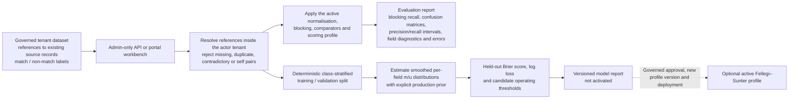

The labelled request contains source-record references, not duplicated demographics,
and is capped at 10,000 pairs. Evaluation and calibration do not modify Patients,
Persons or links. Audit evidence records the dataset identifier, a digest and aggregate
counts, not the pair identifiers. Nickname dictionaries are versioned, culture-labelled
tenant configuration and none are enabled by default.

Calibration is supervised and intentionally conservative: it uses an explicit
production match prior, additive smoothing, a deterministic held-out validation set and
neutral treatment of missing fields. Its output must be approved, inserted into a new
matching profile, deployed consistently and evaluated on an independent holdout before
activation. There is no automatic, adaptive or online learning loop.

See the [assurance guide](/UnifyEMPI/guides/matching-assurance/) and
[ADR 0003](/UnifyEMPI/architecture/decisions/0003-governed-matching-assurance-and-calibration/).

## FHIR source create and update

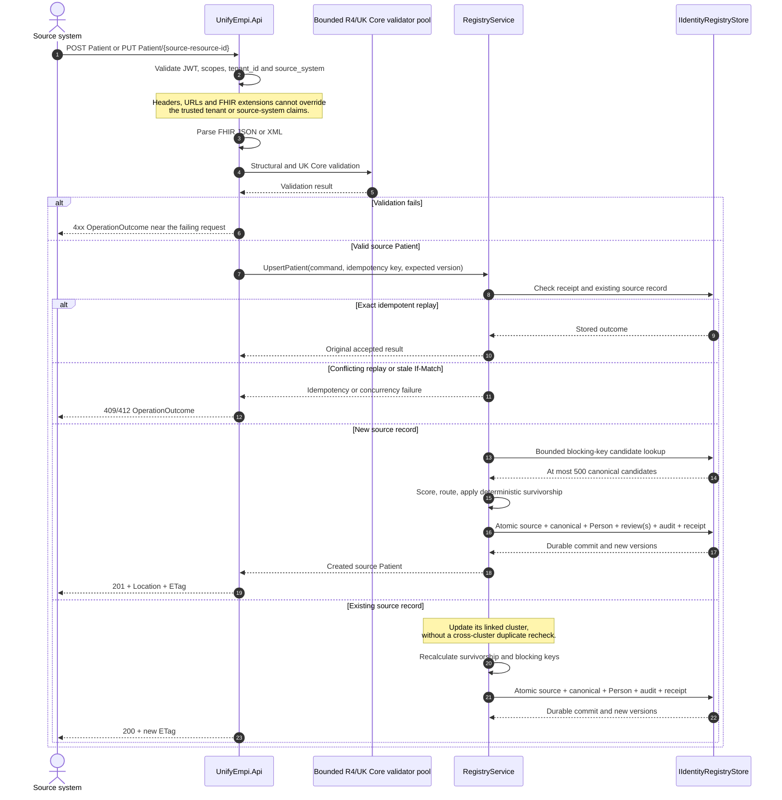

Source credentials can write only their own source profile. Canonical Patients are
server-managed and read-only to consumers.

## FHIR `$match`

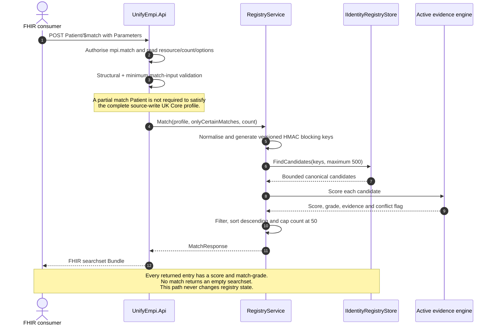

## HL7v2 MLLP ingestion

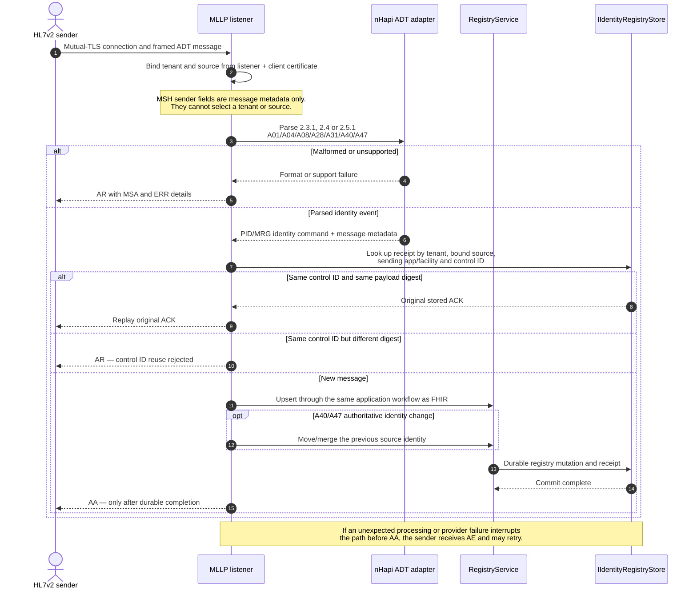

Visit-specific content is ignored because the service is an identity registry. Raw HL7
messages are not retained by default; the receipt holds the digest, source metadata and
original acknowledgement required for safe replay.

## Governed duplicate merge

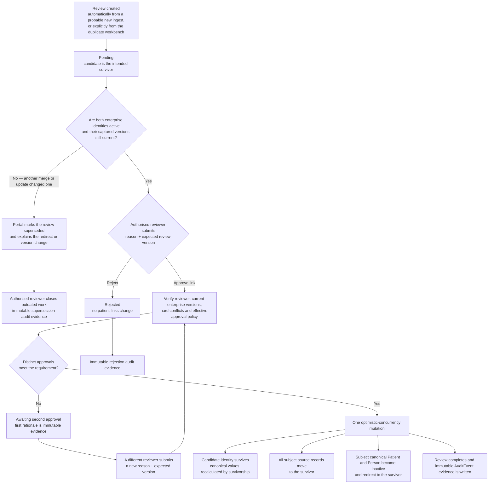

Ordinary duplicate reviews use the tenant's current one- or two-approval policy. If that
policy is reduced while a review is open, an explicit audited decision can adopt the
current lower threshold; the policy change alone never mutates a patient. Reviews
created from a hard conflict lock their two-approval requirement, as do all split
reviews. A reviewer cannot supply both approvals. If another completed merge replaces
an identity, or a source update changes either canonical identity while a review is
open, its captured evidence becomes obsolete. The portal prevents link and reject
decisions, explains the redirect or version change, and lets the reviewer close the
case as superseded without changing patient links. A fresh duplicate search then
captures current demographics, score, evidence and enterprise versions.

## Source unlink and identity split

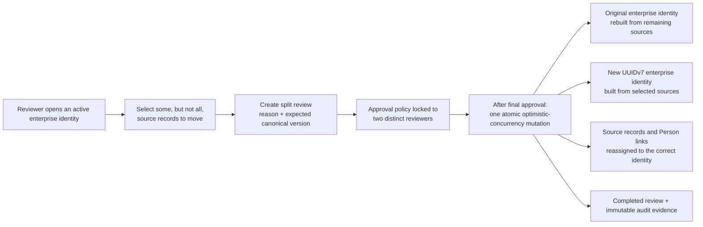

A split is a corrective reassignment, not a hard delete. Both resulting canonical
Patients are deterministically rebuilt from their authoritative source snapshots.

## Canonical materialisation and survivorship

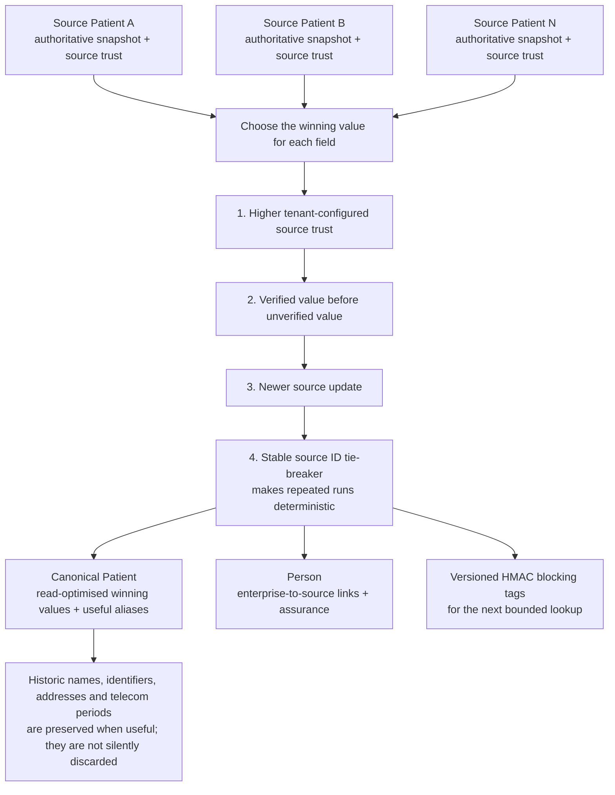

The same rules run on ingest, approved merge and approved split, so the canonical view
does not depend on process order or reviewer preference.

## Tenant and storage safety boundary

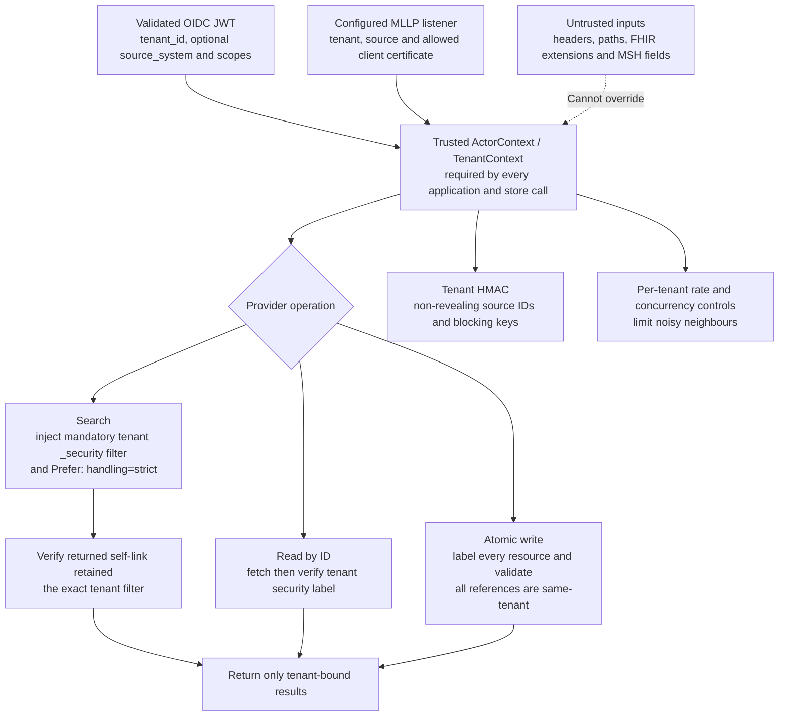

The tenant is the hard data-partition and policy boundary. A tenant usually represents
one organisation or data controller. Tenant identity is established before domain code
runs and is carried through every operation; it is not a user-selectable search
parameter.

## Deliberate boundaries

- Online ingest, `$match` and workbench requests never use a population scan or an
  unbounded all-pairs fallback. The reconciliation worker may page the population, but
  every candidate search remains bounded by blocking keys and runs outside the request
  path.
- There is no asynchronous event bus between protocol hosts and the registry core.
- An update to an existing source-local record does not currently initiate a
  cross-cluster duplicate recheck. Manual or scheduled reconciliation supplies that
  assurance on an explicit operational cadence.
- `$match` and duplicate-workbench searches are read-only; only an ingest or approved
  review changes links.
- External FHIR integration is a bounded, read-only snapshot import. Matching and
  survivorship use stored source snapshots; there is no live remote query during a
  match, no write-through to the source server and no deletion inference from absence.
- Population reconciliation never auto-merges two existing enterprise identities.
  Candidate pairs become governed review cases.
- Ground-truth requests reference records already stored in the tenant. Labels are not
  retained as a training corpus, and audit text contains only a dataset digest and
  aggregate counts.
- Calibration reports a versioned model but never activates it. There is no unsupervised
  EM fitting, adaptive classification or cross-tenant training, and no nickname
  dictionary is enabled by default.
- Runtime provider hot-swapping is not included. A host selects exactly one provider at
  start-up and fails readiness when required capabilities are unavailable.
