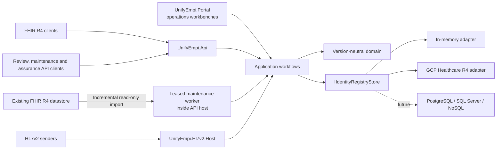

For the implemented request, message and governance sequences, see
[core paths and processing model](/UnifyEMPI/architecture/core-paths/).
For operational terminology, national tenancy choices and common questions, see
[identity model and frequently asked questions](/UnifyEMPI/concepts/identity-model/).

## Dependency rule

The domain contains tenant IDs, source records, enterprise clusters, normalised identity values, match evidence, review cases, decisions, and audit records. It has no Firely, HTTP, GCP, SQL, or HL7 dependencies.

The application implements ingestion, blocking, matching, survivorship, linking,
review, merge, maintenance and assurance workflows. Protocol and portal adapters
translate trusted actor actions into application commands. Persistence adapters
translate `IIdentityRegistryStore` mutations into provider-native atomic operations.

FHIR R4 is isolated in `UnifyEmpi.Fhir.R4`; an R5 adapter can be added beside it without changing domain or persistence contracts.

## Registry materialisation

Each cluster is materialised as:

- source `Patient` resources with authoritative snapshots;
- one `Person` with source links and assurance;
- one read-optimised canonical `Patient`;
- `Task` review cases;
- durable `Task` maintenance jobs with phase, cursor, lease and progress state;
- immutable `AuditEvent` evidence;
- private `Basic` idempotency receipts.

Candidate lookup uses only versioned HMAC blocking tags. Online ingest and query paths
never scan the Patient population. A controlled reconciliation job may page the
population sequentially, but each identity still uses bounded candidate discovery;
there is no population-wide nested comparison.

The canonical Patient is a server-managed enterprise view, not a replacement for its
authoritative source records. Source Patients do not carry blocking tags. New-source
ingestion and user-initiated duplicate checks generate temporary keys from the incoming
or selected profile, then search the stored tags on canonical Patients. This keeps one
candidate per enterprise identity rather than returning every linked source record.

## Match safety

The default evidence engine weights family name 0.25, given names 0.20, birth date
0.30, address/postcode 0.15, telecom 0.07, and gender 0.03. A tenant can instead
activate a versioned Fellegi–Sunter model calibrated from governed labels. `possible`
starts at 0.62 and `probable` at 0.82 unless the approved profile changes them.
`certain` still requires a verified authoritative exact identifier with no
authoritative identifier or birth-date conflict.

Only certain matches auto-link. Probable matches create review cases. A conflicting valid NHS number is a hard stop.

Identifier verification is server-controlled. Wire-level FHIR extensions are treated as untrusted; only identifiers from a tenant-configured authoritative source are persisted as verified/authoritative. A valid authoritative-system identifier supplied to `$match` may establish certainty only when the stored candidate was verified by such a source.

## Background maintenance boundary

Re-index and reconciliation requests create durable tenant-bound jobs. Any healthy API
replica may acquire an expiring lease and resume at the last batch checkpoint. A
configuration fingerprint stops work if matching rules, source trust or blocking
secrets change mid-run. Re-indexing validates old-to-target blocking-key overlap before
mutating canonical resources.

Reconciliation can rebuild registry-derived state, rematch the population and
optionally import changed Patients from an existing FHIR R4 server. The remote adapter
uses bounded `_lastUpdated` searches, a fixed run upper bound and same-origin opaque
next links. It is read-only, does not infer deletion from absence and persists source
snapshots before matching. Existing enterprise identities are never auto-merged;
probable duplicates become deterministic review Tasks.

See [re-indexing and population reconciliation](/UnifyEMPI/guides/maintenance/) and
[ADR 0002](/UnifyEMPI/architecture/decisions/0002-durable-maintenance-jobs-and-fhir-source-boundary/).

## Matching assurance boundary

Administrative evaluation resolves labelled source-record pairs inside one tenant and
reports blocking recall, classification metrics with confidence intervals, field
diagnostics and bounded errors. It does not persist another copy of demographics or
change identity links.

Optional Fellegi–Sunter calibration is supervised: it uses both label classes, an
explicit production prior, additive smoothing and a deterministic stratified held-out
set. The output is a versioned report, not an active model. Activation requires
governed approval, a new matching-profile version, consistent deployment and an
independent holdout evaluation. Versioned nickname dictionaries are tenant configuration
and none are supplied by default.

See [matching assurance and calibration](/UnifyEMPI/guides/matching-assurance/) and
[ADR 0003](/UnifyEMPI/architecture/decisions/0003-governed-matching-assurance-and-calibration/).

## Tenant boundary

Tenant and source identity come only from validated JWT claims or the configured MLLP listener/certificate binding. Headers, resource extensions, URLs, and MSH fields cannot override them.

No query, match or review crosses a tenant boundary. A deployment intended to resolve
identities nationally therefore normally models participating record owners as source
systems within one national tenant. Separate regional tenants require a separate
federation or national-linking design.

The GCP adapter adds defence in depth:

1. mandatory tenant `meta.security`;
2. tenant-bound strict search construction;
3. self-link verification after searches;
4. label verification after reads;
5. same-tenant validation for every transaction resource;
6. no unscoped GCP client outside the adapter.
