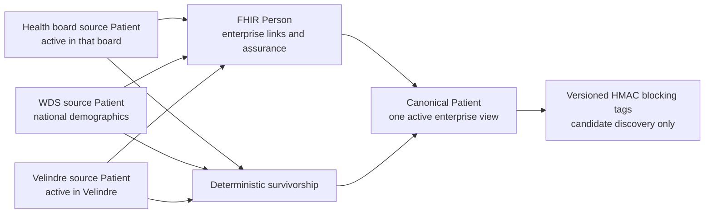

This guide explains the registry model in operational terms. It complements the
[architecture](/UnifyEMPI/architecture/overview/),
[annotated core paths](/UnifyEMPI/architecture/core-paths/) and
[configuration reference](/UnifyEMPI/reference/configuration/).

## Glossary

| Term | Meaning in UnifyEMPI |
| --- | --- |
| MPI | Master patient index: a service that links records believed to describe the same person without replacing the originating systems |
| Tenant | The hard data, security and matching-policy boundary |
| Source system | A configured record-owning feed, such as a Welsh health board, WDS or Velindre |
| Source Patient | The latest authoritative snapshot of one patient record in one source system |
| Enterprise identity | UnifyEMPI's UUIDv7 identity for one believed person within a tenant |
| Enterprise cluster | An enterprise identity and all source records currently linked to it |
| `Person` | The FHIR linkage resource that records the source Patient links and assurance levels for an enterprise identity |
| Canonical Patient | UnifyEMPI's read-optimised, survivorship-based Patient view for an enterprise identity |
| Survivorship | The deterministic policy that chooses displayed canonical values while retaining useful alternatives |
| Blocking key | A non-revealing HMAC index used to find a bounded candidate set before detailed matching |
| Match grade | `certain`, `probable`, `possible` or no match, based on verified identifiers, conflicts and weighted evidence |
| Review case | Governed, versioned evidence for a proposed merge or corrective split |
| Merge | Move the losing identity's source links to the survivor and redirect the losing identity |
| Split | Move selected source links from an existing identity into a new enterprise identity |

## How source, Person and canonical records fit together

Source systems remain authoritative. UnifyEMPI adds an enterprise linkage layer and a
convenient consolidated view:



### What is a source Patient?

A source Patient represents one record owned by one source system. Its stable identity is
the tenant, source-system ID and source-local ID. It contains the most recent accepted
snapshot from that source and points to its current enterprise identity.

Several active source Patients may legitimately describe the same person. For example,
a health-board record, a WDS record and a Velindre record can all be active and linked
to one enterprise identity. A merge does not deactivate those records because the
source organisations still regard them as active.

### What is a canonical Patient?

A canonical Patient is UnifyEMPI's materialised view of one enterprise identity. It is
rebuilt from the linked source records using source trust, verification, recency and
stable tie-breakers. Useful historic or alternative names, identifiers, addresses and
telecoms can remain available as aliases.

Canonical does not mean infallible clinical truth. It means UnifyEMPI's current,
deterministic consolidated view. It is server-managed and read-only to FHIR clients.
Accepted source-system updates cause it to be recalculated.

| Property | Source Patient | Canonical Patient |
| --- | --- | --- |
| Scope | One record in one source | One enterprise identity |
| Owner | The configured source system | UnifyEMPI |
| Expected count | Many may link to one enterprise identity | One per enterprise identity; retired identities remain as inactive redirects |
| FHIR ID | Stable, non-revealing source-resource ID | UUIDv7 enterprise ID |
| Writes | Accepted only for the owning source context | Server-managed and read-only |
| `active` meaning | Active in the originating source | Active enterprise identity |
| Blocking tags | None | Yes |
| Internal `meta.tag` code | `source-patient` | `canonical-patient` |

### What does the FHIR `Person` add?

The `Person` is the linkage record. It lists the source Patients belonging to the
enterprise identity and their assurance levels. The canonical Patient is the
read-optimised demographic view. They share the enterprise ID but serve different
purposes.

### Why can the GCP FHIR store show several active Patients with the same name?

The store contains source and canonical Patient resources together. `Patient.active`
does not by itself say which role a resource has. Inspect:

- `meta.tag` code `source-patient` or `canonical-patient`;
- the source Patient's enterprise-ID and source-system extensions;
- the corresponding `Person` links; and
- any inactive canonical Patient's `replaced-by` link.

Two active source Patients linked to one enterprise ID are expected. Two similar active
canonical Patients are separate enterprise identities until automated certainty or a
governed merge establishes that they belong together.

## Tenants and national deployment

### What is a tenant?

A tenant is the hard data, security, indexing and policy partition. Every registry read,
write, match, review, receipt and audit event is bound to a trusted tenant context.
UnifyEMPI does not search, match or link across tenants.

For HTTP traffic, `tenant_id` comes only from a validated identity-provider claim. For
HL7v2, it comes from the configured listener and client-certificate binding. A header,
URL, FHIR extension or MSH field cannot select or override it.

Tenant-specific configuration includes:

- source systems and source trust;
- authoritative identifier sources;
- matching thresholds and approval policy;
- HMAC secrets and key versions; and
- rate and concurrency controls.

### Should Wales use one tenant per health board?

Not if the primary requirement is a national MPI. Separate tenants for Cardiff and Vale,
Aneurin Bevan, Betsi Cadwaladr and other organisations would prevent UnifyEMPI from finding
or linking the same person across those boundaries.

A national pattern is one source boundary for each configured Welsh organisation or
national service. The identifiers below are illustrative configuration keys:

```text
Tenant: nhs-wales
  Source: aneurin-bevan
  Source: betsi-cadwaladr
  Source: cardiff-and-vale
  Source: cwm-taf-morgannwg
  Source: hywel-dda
  Source: powys
  Source: swansea-bay
  Source: wds
  Source: velindre
  Source: <other configured national organisation>
```

In the current Welsh model, the source ID represents the organisation-level feed—not
an application-type category. Keep the deployed IDs aligned with the agreed interface
catalogue. Source trust and identifier authority can then differ for each health board,
WDS, Velindre and any additional national source inside the one tenant.

One national tenant also means that identities holding tenant-wide reviewer permissions
can access the national registry. The current release does not provide source-level
visibility partitions for reviewers inside a tenant. Regional access restrictions,
purpose-of-use controls and break-glass rules therefore need an agreed identity and
authorisation design, and may require additional product work.

Use separate tenants only when legal, controller or operational isolation is more
important than cross-boundary matching. The current milestone has no live cross-tenant
federation; a separate national linking layer would be required in that model.

## Blocking, matching and duplicate checks

### What is HMAC?

HMAC means Hash-based Message Authentication Code. UnifyEMPI combines a normalised lookup
value with a tenant secret and SHA-256 to produce a deterministic, one-way digest. The
same input under the same key version produces the same tag, so it can be indexed, but
the raw NHS number, name, postcode, telephone number or email address is not stored in
the tag.

HMAC is not encryption and cannot be decrypted. Its protection depends on keeping the
tenant secret out of code, configuration files, logs and metrics. Production secrets
must come from a managed secret store.

### What are the blocking tags on a canonical Patient?

Available normalised inputs produce HMAC tags for:

- a tenant-authoritative identifier;
- family name and date of birth;
- phonetic family name and date of birth;
- postcode and date of birth;
- telephone or SMS number; and
- email address.

They are stored in this shape:

```text
system: https://unifyempi.dev/CodeSystem/blocking/v1
code:   <64-character HMAC-SHA256 digest>
```

The system identifies the key version, not the demographic field. This is deliberate:
the stored tag is opaque. During rotation, a canonical Patient may temporarily have tags
for active and previous versions.

A blocking tag is neither a security label nor proof of a duplicate. It only admits a
Patient to the bounded candidate set used by the detailed evidence engine.

### How does a user-initiated duplicate check work if source Patients have no tags?

The duplicate workbench operates on enterprise identities:

1. Load the selected active canonical Patient.
2. Normalise its materialised profile.
3. Regenerate temporary blocking keys in memory with the tenant's active and previous
   HMAC secrets.
4. Search the union of those tags on canonical Patients in the same tenant.
5. Remove the selected identity, inactive identities and duplicate results.
6. Apply the full weighted matcher to at most 500 candidates.
7. Return ordered scores, grades and field-level evidence.

The selected Patient's keys initiate the search; the tags stored on every other
canonical Patient make those identities discoverable. Source values contribute through
survivorship and retained aliases in the canonical profile. Searching source Patients
directly would incorrectly return several rows for one already-linked enterprise
identity.

### When is duplicate detection run?

| Trigger | Behaviour |
| --- | --- |
| New FHIR or HL7 source record | Real-time candidate lookup and scoring before durable commit |
| Existing source-local record update | Rebuild its current cluster; no cross-cluster recheck in this release |
| FHIR `$match` | Real-time, read-only candidate lookup and scoring |
| Portal duplicate workbench | User-initiated, read-only until a review is opened |
| Overnight population scan | Not included |

A new source record auto-links only on a `certain` result. A probable result creates a
review while preserving separate identities. A possible result can be returned but is
not queued by default.

### Can blocking miss a duplicate?

Yes. Blocking intentionally favours bounded performance over an all-against-all scan.
Two identities must share at least one generated blocking input before the fuzzy
evidence engine sees them. Phonetic family name plus date of birth catches many spelling
variations, but records with no shared identifier, date/name block, postcode/date block
or contact value require a separate reconciliation strategy.

More than 500 candidates is also rejected safely; the caller must supply stronger
identifying data. A future scheduled reconciliation service can revisit records, but it
must still use bounded partitions rather than a population-wide nested comparison.

### What is the difference between `$match` and a merge?

FHIR `Patient/$match` and the portal duplicate search are read-only. They return
candidates and evidence but do not change links. A merge begins only through a governed
review and completes atomically after the required distinct approvals.

## Reviews, merges and splits

### What does “Only active enterprise identities can be linked” mean?

At least one identity in the review has already been retired, usually by another merge.
Applying the old review could create a link to an obsolete identity, so UnifyEMPI stops
without making a partial change.

Follow the inactive Patient's `replaced-by` link, close the old case as superseded, and
run a fresh duplicate search against the surviving active identities.

### What does “An enterprise identity changed after the review was created” mean?

The subject or candidate canonical version no longer matches the version captured in
the review. A source update, merge, split or survivorship change may have altered the
evidence. This is optimistic concurrency protection, not a transient server error.

Inspect the changed values, close the stale case as superseded, rerun duplicate
detection and create a fresh review if the match still holds. No merge is partially
applied.

### What happens if the approval policy changes?

Ordinary duplicate reviews use the tenant's current one- or two-approval policy.
Reducing the policy can allow an already-recorded approval to meet the current
threshold, but the final completion action remains audited. Increasing it requires a
second distinct reviewer. A reviewer cannot approve the same case twice.

Hard-conflict duplicate reviews and all split reviews lock their two-approval
requirement, regardless of later ordinary-policy changes.

### What survives a merge?

The chosen survivor remains active. The losing canonical Patient and `Person` become
inactive and redirect to the survivor. Source records move to the surviving cluster but
remain intact and active according to their source state. Canonical demographics and
blocking tags are recalculated, and immutable audit evidence records the decision.

Splitting is similarly non-destructive: selected source links move to a new enterprise
identity and both canonical views are rebuilt.

## Using an existing GCP FHIR store

### Can UnifyEMPI use a store that already contains millions of Patients?

The records can be onboarded, but changing `GcpHealthcare:StoreName` is not sufficient.
An arbitrary existing store does not contain UnifyEMPI's tenant security labels,
source/canonical role tags, enterprise links, logical versions, blocking tags, review
resources or idempotency receipts. The GCP adapter deliberately ignores unrecognised
Patients during canonical candidate lookup.

The current milestone does not include a purpose-built bulk importer or live federation
with an arbitrary existing store. Treat onboarding as a controlled integration
programme.

### Recommended onboarding pattern

1. Define the national tenant, every source namespace, authoritative identifiers,
   source trust and governance policy.
2. Prefer a dedicated UnifyEMPI FHIR store so registry resources and operational policies
   do not change the semantics of an existing clinical store.
3. Build a resumable importer that reads Patients without changing them, preserves each
   original ID as the source-local ID, and submits source records through the same
   application ingestion path as live traffic, where UnifyEMPI validates and normalises
   them.
4. Use stable idempotency keys, checkpoints and reconciliation totals so a replay cannot
   create a second source record.
5. Run synthetic and sampled dry runs to measure validation failures, candidate breadth,
   probable-review volume and false-link safety before the full import.
6. Backfill in controlled partitions, monitor the 500-candidate guard and review queues,
   then reconcile source counts, enterprise counts and failure receipts.
7. Establish change-data capture or normal FHIR/HL7 feeds before cut-over so the index
   remains current.
8. Test rollback, disaster recovery, tenant isolation and redirect handling before
   consumers rely on canonical identities.

Using the existing store itself is possible only after a migration design accounts for
resource IDs, mandatory tenant labels, write ownership, UnifyEMPI's private resource
types, transaction boundaries and rollback. Do not relabel or convert production
Patient resources in place without a separately tested migration and clinical-safety
assessment.

### What value does the MPI add beside the existing store?

- one national enterprise identity across source namespaces;
- bounded real-time duplicate discovery rather than name-only searching;
- explainable scores, hard NHS-number conflict handling and governed decisions;
- deterministic survivorship with provenance instead of destructive source overwrites;
- redirects after merges and corrective source-level splits;
- FHIR `$match`, HL7v2 identity ingestion and idempotent processing; and
- review workload, immutable audit evidence and operational metrics.

The source store remains authoritative. UnifyEMPI adds identity resolution and governance;
it is not a replacement clinical record.

## Portal and API questions

### What can users edit?

The Welsh health-board, WDS, Velindre and other organisation-owned source snapshots are
read-only in the operations portal. Optional portal patient-write functionality exists
only for deployments that deliberately configure a separate UI-managed source and grant
`mpi.patient.write`; it is not a national source in the Welsh source model. Canonical
Patients are always server-managed; changing source data or governed links causes them
to be rebuilt.

### How can `$match` be demonstrated?

Use the [Postman collection and guide](/UnifyEMPI/guides/postman/). It includes discovery,
canonical search, JSON/XML matching, safe error examples, local synthetic source writes
and read-only reviewer operations. It targets localhost by default and includes
assertions for the FHIR searchset, score and `match-grade`. Never use real patient
information in a demonstration environment.

## Build and security questions

### What should I do if antivirus reports a generated DLL?

Treat the alert as real until investigated; do not create a Defender exclusion merely
to make the build pass. A path under `bin` or `obj` is locally generated and is not
evidence by itself that the file is safe or malicious. Record the exact Defender threat
name, file hash, detection time and affected package versions.

A safe first investigation is:

```powershell
Get-FileHash .\tests\UnifyEmpi.Storage.ContractTests\bin\Release\net10.0\UnifyEmpi.Storage.ContractTests.dll -Algorithm SHA256
dotnet clean UnifyEMPI.slnx -c Release
dotnet nuget locals all --clear
dotnet restore UnifyEMPI.slnx --locked-mode
dotnet build UnifyEMPI.slnx -c Release --no-restore
dotnet test UnifyEMPI.slnx -c Release --no-build
```

Compare a clean rebuild on a patched machine or CI runner, inspect the locked dependency
graph, run the repository's package-vulnerability and container scans, and submit the
file to Microsoft for analysis if a reproducible hash appears to be a false positive.
If the detection changes, reappears before restore, affects source files or is confirmed
by another scanner, stop using the machine for releases and follow the organisation's
incident-response process.

Do not upload a DLL containing confidential information to a public scanning service.
Test assemblies must never be deployed in production images.

## Where to go next

- [Core paths and processing model](/UnifyEMPI/architecture/core-paths/): annotated request, match, merge,
  split, survivorship and isolation diagrams.
- [Architecture](/UnifyEMPI/architecture/overview/): dependency boundaries and provider model.
- [Configuration](/UnifyEMPI/reference/configuration/): API, portal, tenant, HMAC and MLLP settings.
- [GCP demonstration deployment](/UnifyEMPI/deployment/public-demo/): synthetic topology and safe operation.
- [Provider ADR](/UnifyEMPI/architecture/decisions/0001-modular-monolith-and-provider-contract/): the storage
  abstraction decision.
