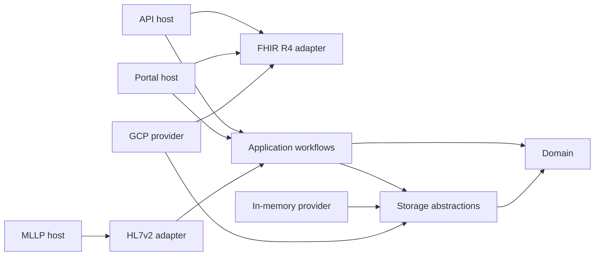

This guide is the practical map for working on UnifyEMPI. It explains where code
lives, how the projects depend on one another, how to follow a request through the
system, and how to run the same checks used by continuous integration.

Read the [architecture overview](/UnifyEMPI/architecture/overview/) and
[identity model](/UnifyEMPI/concepts/identity-model/) before changing matching,
tenancy or persistence semantics. Use the
[contribution guide](/UnifyEMPI/development/contributing/) for safety and pull-request
expectations.

## Prerequisites

The application build requires:

- the .NET SDK selected by `global.json` (`10.0.300`, with roll-forward to a later
  10.0.3xx patch);
- Git;
- Docker Desktop for the containerised local stack; and
- PowerShell 7 for the repository scripts.

Documentation work additionally requires Node.js 22.12 or later and pnpm 11.9.0.
Install k6 only when working on the end-to-end load scenario.

Check the most important tool versions from the repository root:

```powershell
dotnet --version
docker compose version
node --version
pnpm --version
```

The .NET SDK is pinned so local builds, CI and generated lock files use the same
toolchain family. Do not change `global.json` as a workaround for a local SDK problem.

## Repository shape

| Path | Purpose |
| --- | --- |
| `UnifyEMPI.slnx` | The application, routine test and benchmark projects built by the solution |
| `src/` | Production projects, split into hosts, protocol adapters, application workflows, domain types and storage adapters |
| `tests/` | Unit, integration, protocol and provider-contract tests |
| `tests/ProviderContract/` | One shared conformance suite compiled into each storage-provider test project |
| `benchmarks/` | BenchmarkDotNet scoring benchmark, checked-in baseline and k6 `$match` scenario |
| `docs-site/` | Astro Starlight documentation source |
| `scripts/` | Benchmark gate, FHIR package download and GCP demo lifecycle scripts |
| `deploy/` | Compose support, OpenTelemetry configuration, Helm chart and Terraform reference infrastructure |
| `.github/workflows/` | CI, security, benchmark and documentation publishing workflows |
| `Directory.Build.props` | Repository-wide compiler, analyser, style and lock-file rules |
| `Directory.Packages.props` | Central NuGet package versions |
| `global.json` | Pinned .NET SDK feature band |

Generated `bin/`, `obj/`, `TestResults/`, `BenchmarkDotNet.Artifacts/`, Terraform state,
IDE state and documentation dependencies are ignored. Do not use generated files to
understand an implementation; start from the project and source files above them.

## Source projects

The code is a modular monolith with three executable hosts and a shared application
core.

| Project | Responsibility | Good starting points |
| --- | --- | --- |
| `UnifyEmpi.Api` | ASP.NET Core FHIR R4, SMART discovery, review, maintenance and assurance endpoints | `Program.cs`, `FhirEndpoints.cs`, `Security.cs` |
| `UnifyEmpi.Hl7v2.Host` | Worker host that binds configured TCP/TLS MLLP listeners | `Program.cs`, `MllpListenerWorker.cs`, `MllpHostOptions.cs` |
| `UnifyEmpi.Portal` | Blazor Interactive Server operations portal | `Program.cs`, `Components/Pages/`, `Components/Shared/` |
| `UnifyEmpi.Application` | Ingestion, matching, survivorship, review, merge, split, assurance and maintenance workflows | `RegistryService.cs`, `RegistryMaintenanceService.cs`, `Matching/`, `Normalisation/` |
| `UnifyEmpi.Domain` | Version- and provider-neutral records, identifiers, evidence, decisions and exceptions | `IdentityModels.cs`, `MatchingModels.cs`, `RegistryModels.cs` |
| `UnifyEmpi.Fhir.R4` | Firely R4 parsing, serialisation, validation and domain mapping | `FhirResourceCodec.cs`, `FhirR4Mapper.cs`, `PatientValidation.cs` |
| `UnifyEmpi.Hl7v2` | MLLP framing, ADT parsing, acknowledgements and ingestion adaptation | `MllpConnectionProcessor.cs`, `Hl7v2AdtParser.cs`, `Hl7v2IngestionProcessor.cs` |
| `UnifyEmpi.Storage.Abstractions` | Provider-neutral persistence contract and mutation models | `IIdentityRegistryStore.cs`, `RegistryStoreModels.cs` |
| `UnifyEmpi.Storage.InMemory` | Ephemeral development and test provider | `InMemoryIdentityRegistryStore.cs` |
| `UnifyEmpi.Storage.Gcp` | GCP Healthcare API R4 provider and domain-resource mapping | `GcpIdentityRegistryStore.cs`, `HealthcareApiFhirClient.cs`, `GcpDomainResourceMapper.cs` |

The intended dependency direction is:



Keep protocol and provider types at the edges. In particular:

- Firely types belong in `UnifyEmpi.Fhir.R4` or a host boundary, not in the domain or
  storage contract;
- GCP resource names, query construction and client types belong in
  `UnifyEmpi.Storage.Gcp`;
- HTTP identities are converted to a trusted `ActorContext` before application work;
  and
- every application and storage operation remains tenant-bound.

## How to follow a feature

Use these paths to move from an external action to its implementation:

| Feature | Path through the code |
| --- | --- |
| FHIR create, update, read, search or `$match` | `Api/Program.cs` → `Api/FhirEndpoints.cs` → `Fhir.R4/FhirResourceCodec.cs` and `FhirR4Mapper.cs` → `Application/RegistryService.cs` → `IIdentityRegistryStore` |
| Matching and blocking | `RegistryService.MatchAsync` or `UpsertPatientAsync` → `Normalisation/IdentityNormaliser.cs` → `Matching/BlockingKeyGenerator.cs` → `Matching/WeightedIdentityMatcher.cs` → `Matching/SurvivorshipService.cs` |
| HL7v2 ADT ingestion | `Hl7v2.Host/MllpListenerWorker.cs` → `Hl7v2/MllpConnectionProcessor.cs` → `Hl7v2AdtParser.cs` → `Hl7v2IngestionProcessor.cs` → `RegistryService.UpsertPatientAsync` |
| Portal page | The route in `Portal/Components/Pages/*.razor` → injected `RegistryService`, `RegistryMaintenanceService` or `MatchingAssuranceService` → storage contract |
| Review, merge or split | API endpoint or portal page → methods in `RegistryService.cs` → one optimistic-concurrency `RegistryMutation` |
| Re-index or reconciliation | `Api/FhirEndpoints.cs` → `RegistryMaintenanceService.cs`; background batches are driven by `Api/RegistryMaintenanceWorker.cs` |
| Storage behaviour | `Storage.Abstractions/IIdentityRegistryStore.cs` → selected adapter → shared tests in `tests/ProviderContract/ProviderContractSuite.cs` |

When deciding where a change belongs:

- put stable business concepts and invariants in `UnifyEmpi.Domain`;
- put a use-case workflow that coordinates matching and storage in
  `UnifyEmpi.Application`;
- put JSON, XML, HTTP, FHIR or HL7 translation in its adapter or host;
- change `IIdentityRegistryStore` only when every provider genuinely needs a new
  capability; and
- keep rendering and form state in the portal rather than moving UI concerns into the
  application layer.

`rg` is the quickest navigation tool. For example:

```powershell
rg -n "MatchAsync|UpsertPatientAsync" src tests
rg -n "IIdentityRegistryStore" src tests
rg -n '@page ' src/UnifyEmpi.Portal/Components/Pages
rg -n "Map(Post|Put|Get)" src/UnifyEmpi.Api/FhirEndpoints.cs
```

## Restore, format and build

Run commands from the repository root. The normal first build is:

```powershell
dotnet restore UnifyEMPI.slnx --locked-mode
dotnet build UnifyEMPI.slnx -c Debug --no-restore
```

Before submitting a change, use the full CI-equivalent sequence:

```powershell
dotnet restore UnifyEMPI.slnx --locked-mode
dotnet format UnifyEMPI.slnx --no-restore --verify-no-changes
dotnet build UnifyEMPI.slnx -c Release --no-restore
dotnet test UnifyEMPI.slnx -c Release --no-build
```

Warnings, recommended analyser findings and style failures are build errors. Package
versions are centralised in `Directory.Packages.props`, while every project has a
`packages.lock.json`. For an intentional dependency update:

1. change the version once in `Directory.Packages.props`;
2. run `dotnet restore UnifyEMPI.slnx --force-evaluate`;
3. review all changed lock files; and
4. repeat the locked restore and full CI-equivalent checks.

## Run locally

### Containerised stack

The quickest full-stack start is:

```powershell
docker compose up --build
```

This exposes the API and Swagger UI at `http://localhost:8080`, the portal at
`http://localhost:8081`, and MLLP at `localhost:2575`. Stop it with:

```powershell
docker compose down
```

:::caution[The development hosts do not share data]
Each host gets its own `InMemoryIdentityRegistryStore`. API writes are not visible in
the portal or MLLP host, MLLP writes are not visible through the API, and the portal
seeds only its own store. This is intentional for the zero-dependency development
stack. Use an isolated durable provider when testing cross-host behaviour.
:::

### Individual processes

Running one host directly gives the shortest edit-debug cycle. Development settings
disable external authentication, select the in-memory provider and use the synthetic
`demo` tenant.

API:

```powershell
$env:DOTNET_ENVIRONMENT = "Development"
dotnet watch --project src/UnifyEmpi.Api -- --urls http://localhost:8080
```

Portal:

```powershell
$env:DOTNET_ENVIRONMENT = "Development"
dotnet watch --project src/UnifyEmpi.Portal -- --urls http://localhost:8081
```

MLLP listener:

```powershell
$env:DOTNET_ENVIRONMENT = "Development"
dotnet watch --project src/UnifyEmpi.Hl7v2.Host
```

An IDE launch profile may set the environment automatically. If it does not, set
`DOTNET_ENVIRONMENT` explicitly as shown above:

```powershell
$env:DOTNET_ENVIRONMENT = "Development"
dotnet run --project src/UnifyEmpi.Api -- --urls http://localhost:8080
```

Only invented data may be used. In-memory data disappears whenever the process
restarts.

## Debugging

Open `UnifyEMPI.slnx` in an IDE with .NET 10 support and choose one of the three host
projects as the startup project. Confirm the environment is `Development`, then set a
breakpoint at the relevant boundary:

| Problem area | Useful first breakpoint |
| --- | --- |
| FHIR request or operational API | The matching handler in `FhirEndpoints.cs`, such as `MatchPatient` or `CreatePatient` |
| Authentication or tenant/source claims | `ActorContextFactory` in `Api/Security.cs` |
| Ingest or matching outcome | `RegistryService.UpsertPatientAsync` or `RegistryService.MatchAsync` |
| Candidate score | `WeightedIdentityMatcher` and the selected comparator in `Application/Matching/` |
| Canonical field choice | `SurvivorshipService` |
| HL7 connection or ACK | `MllpConnectionProcessor.ProcessAsync` or `Hl7v2IngestionProcessor.ProcessAsync` |
| Portal action | The event handler in the routed `.razor` page, then its injected application service |
| Maintenance job | `RegistryMaintenanceService.ProcessJobBatchAsync` |
| Persistence | The selected method on `InMemoryIdentityRegistryStore` or `GcpIdentityRegistryStore` |

Prefer debugging a focused automated test when the behaviour does not require a live
host. IDE test explorers can debug xUnit tests directly, and a narrow test normally
provides deterministic setup and a shorter call stack.

Application configuration follows standard .NET precedence: base `appsettings.json`,
environment-specific settings, development user secrets for the API and portal,
environment variables, then command-line arguments. Environment variable keys use
double underscores:

```powershell
$env:RegistryProvider__Type = "InMemory"
$env:Authentication__Enabled = "false"
```

Use user secrets or environment variables for local credentials. Never add secrets,
tokens, certificates or real patient data to an appsettings file.

## Tests

The routine solution contains seven test projects:

| Project | Coverage |
| --- | --- |
| `UnifyEmpi.Domain.Tests` | Normalisation, NHS-number validation, blocking, scoring, survivorship, registry workflows, assurance and maintenance |
| `UnifyEmpi.Fhir.R4.Tests` | JSON/XML mapping, match bundles, FHIR validation and tenant assertions |
| `UnifyEmpi.Hl7v2.Tests` | ADT versions/triggers, parser failures, framing, replay and identity-change handling |
| `UnifyEmpi.Api.Tests` | In-process ASP.NET API, Swagger, FHIR flows, ETags, tenant safety and external FHIR paging |
| `UnifyEmpi.Portal.Tests` | In-process portal rendering, resilience, assurance parsing and review guidance |
| `UnifyEmpi.Storage.ContractTests` | Shared provider contract against the in-memory adapter |
| `UnifyEmpi.Storage.Gcp.Tests` | Shared contract and defensive GCP adapter behaviour using a deterministic in-process fake; no GCP account is used |

Run all routine tests:

```powershell
dotnet test UnifyEMPI.slnx -c Release
```

Run one project during development:

```powershell
dotnet test tests/UnifyEmpi.Domain.Tests -c Debug
```

Run one class or method with the VSTest filter syntax:

```powershell
dotnet test tests/UnifyEmpi.Domain.Tests -c Debug `
  --filter "FullyQualifiedName~RegistryWorkflowTests"

dotnet test tests/UnifyEmpi.Api.Tests -c Debug `
  --filter "FullyQualifiedName~PatientCreateReadAndMatchFlowUsesEtags"
```

List discovered tests when constructing a filter:

```powershell
dotnet test UnifyEMPI.slnx --list-tests
```

Add tests at the lowest boundary that proves the behaviour, then add a host-level test
when serialisation, authentication, routing or dependency wiring is part of the
contract. Storage-adapter changes must continue to pass the shared provider suite.

`UnifyEmpi.Storage.Gcp.LiveTests` is deliberately excluded from `UnifyEMPI.slnx`.
It writes to the store named by `GCP_FHIR_STORE` and must only run against an isolated,
disposable R4 store. See the
[live GCP test guide](/UnifyEMPI/development/live-gcp-tests/) before invoking it.

## Benchmarks

There are two runnable performance tools with different purposes:

- BenchmarkDotNet measures one in-process scoring operation over 500 pre-normalised
  candidates and feeds the CI regression gate.
- k6 measures the end-to-end HTTP `$match` path against a running environment.

Do not compare the BenchmarkDotNet mean with k6 latency percentiles. Run the exact
commands, interpret the baseline and configure a short k6 smoke run in the
[performance guide](/UnifyEMPI/development/performance/).

## Documentation

Documentation source is under `docs-site/src/content/docs`. The navigation is explicit
in `docs-site/astro.config.mjs`, so add new pages there as well as creating the Markdown
file.

Preview and validate the site:

```powershell
Set-Location docs-site
pnpm install --frozen-lockfile
pnpm dev
```

Before committing documentation:

```powershell
pnpm build
```

The production build validates internal links, heading fragments and Mermaid diagrams.
Site-root links include the GitHub Pages base path, for example
`/UnifyEMPI/development/developer-guide/`.

## Continuous integration

`.github/workflows/ci.yml` is the source of truth for merge checks. It:

- builds the documentation and audits its dependencies;
- restores locked NuGet dependencies, verifies formatting, builds and tests;
- audits transitive NuGet packages;
- builds, scans and creates SBOMs for all three container images;
- runs the core scoring benchmark and regression gate; and
- exposes the live GCP tests only as a manually dispatched, protected-environment job.

The separate documentation workflow publishes `docs-site` from the default branch.
When local behaviour differs from CI, compare the local command, configuration and SDK
with the workflow before changing production code.

## Common problems

| Symptom | Check |
| --- | --- |
| The wrong SDK is selected | Run `dotnet --version` from the repository root and install the SDK pinned by `global.json` |
| Locked restore fails after a package change | Confirm the central version edit is intentional, regenerate with `--force-evaluate`, and review every lock-file change |
| A host reports that no provider is configured | Start it in `Development` or supply exactly one valid `RegistryProvider__Type` |
| Port 8080, 8081 or 2575 is occupied | Stop the Compose stack or pass a different HTTP URL; change the development MLLP listener port in configuration |
| Data written through one host is missing from another | The development in-memory providers are isolated per process |
| A filtered test finds no matches | Run `--list-tests` and filter on a fully qualified class or method fragment |
| The benchmark gate cannot find a report | Run the BenchmarkDotNet command from the repository root with the JSON exporter before running the PowerShell gate |
| A documentation link fails only in production build | Use the `/UnifyEMPI/` base path and run `pnpm build` to validate the target and heading |
