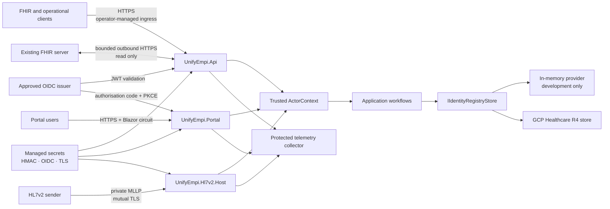

This page describes the security controls implemented by UnifyEMPI, the trust placed
in its surrounding platform, and the controls that a deploying organisation must add.
It is an implementation guide, not a claim of certification or a substitute for a
deployment-specific threat model, DPIA, clinical-safety case or penetration test.

Use the [security policy](/UnifyEMPI/governance/security/) to report a vulnerability
privately. Use [production readiness](/UnifyEMPI/governance/production-readiness/) as
the go-live gate.

:::caution[Engineering foundation]
The Compose stack and public demo deliberately disable external authentication and
must contain synthetic data only. They are not security reference architectures.
:::

## Security objectives

The implemented design aims to:

- derive tenant, source and actor identity only from authenticated trust anchors;
- prevent reads, matches, writes, reviews and audit searches from crossing tenants;
- give service and interactive identities only the capabilities represented by their
  scopes;
- prevent external payloads, headers, routes and HL7 sender fields from overriding the
  trusted security context;
- keep online candidate discovery bounded and protect it with non-revealing HMAC tags;
- make material changes atomic, concurrency-checked, attributable and auditable;
- reject unsafe storage and external-FHIR behaviour rather than silently weakening a
  boundary; and
- keep patient values out of logs, traces, metrics and ordinary exceptions.

Availability, identity-provider security, cloud IAM, network perimeter protection,
encryption at rest, key custody, backup security, endpoint security and operational
monitoring remain shared or deployment responsibilities.

## Trust boundaries

The API and portal have different identity models:

- API requests carry a validated bearer token. A `tenant_id` claim is mandatory and a
  `source_system` claim is mandatory for source Patient writes.
- The portal creates a server-side cookie session after OIDC login and requires exactly
  one tenant claim for the whole session.
- Each MLLP listener has a deployment-configured tenant and source. The authenticated
  client certificate selects the trusted listener; MSH fields do not select security
  context.

All three are converted into an `ActorContext` before application or storage work.
Headers such as `X-Tenant-Id` and `X-Source-System`, FHIR extensions, URLs, form values
and MSH fields cannot replace that context.

## Data and assets

Treat the following as sensitive:

| Asset | Security significance |
| --- | --- |
| Source and canonical Patients | Identifiable clinical-adjacent demographic data |
| `Person` links | Reveal that records across source systems are believed to represent one person |
| Review Tasks and rationales | Contain identity evidence, actor decisions and potentially sensitive free text |
| AuditEvents | Contain actor, action, outcome, rationale and correlation evidence |
| Maintenance Tasks and configuration | Reveal operational state and matching-policy changes |
| Idempotency receipts | Bind source messages and requests to processing outcomes |
| HMAC blocking secrets | Permit generation and testing of deterministic candidate-index values |
| OIDC client secrets and bearer tokens | Grant access as a user or service identity |
| MLLP private keys and client certificates | Establish sender identity and source binding |
| Portal Data Protection keys | Protect authentication cookies and other ASP.NET Core protected data |
| Backups, traces and exported reports | May reproduce or expose sensitive operational or patient information |

HMAC blocking tags are pseudonymous indexes, not anonymous data. They cannot be
decrypted, but low-entropy inputs may be testable by an attacker who obtains the tenant
secret. Protect the store and the HMAC secrets independently.

## API security

### Authentication and trusted claims

Production API authentication uses ASP.NET Core JWT bearer validation against the
configured OIDC authority and audience. HTTPS metadata is required by default and
inbound claim mapping is disabled so published claim names remain explicit.

Every protected handler creates an `ActorContext` from:

- `tenant_id`, which is required;
- `sub` or the name identifier, used as the actor;
- optional `source_system`, required for source Patient writes;
- `scope` and `scp`, split into individual permissions; and
- the ASP.NET Core trace identifier, used for correlation.

The server rejects requests that contain tenant or source override headers even when a
valid token is also present. FHIR resources are also rejected when they attempt to
assert server-owned source or authority metadata.

The following discovery and diagnostic surfaces do not require authentication:

- `GET /fhir/R4/metadata`;
- `GET /.well-known/smart-configuration`;
- Swagger UI at `/` and its OpenAPI document; and
- liveness and readiness endpoints.

Restrict diagnostics and Swagger at the ingress if they should not be internet-visible.
All FHIR data, review and operational endpoint groups require authentication and the
per-tenant concurrency limiter.

### API permission matrix

`mpi.admin` satisfies every permission helper. The effective permissions implemented by
the handlers are:

| Operation | Required permission |
| --- | --- |
| Create or update a source Patient | `system/Patient.write`, a compatible SMART v2 write capability, or `mpi.admin`; token must also contain `source_system` |
| Read a Patient by ID | `mpi.match`, a compatible Patient read capability, or `mpi.admin` |
| Search canonical Patients | Patient read capability as above, and no `source_system` claim |
| Run `Patient/$match` | `mpi.match` or `mpi.admin` |
| Read or search `Person` | `mpi.review` or `mpi.admin` |
| Search, inspect or decide reviews; open merge or split reviews | `mpi.review` or `mpi.admin` |
| Operations summary | `mpi.operations`, `mpi.review` or `mpi.admin` |
| Patient identity detail and duplicate search | `mpi.review` or `mpi.admin` |
| Search audit events | `mpi.audit` or `mpi.admin` |
| Read tenant settings | `mpi.config.read`, `mpi.config.write`, `mpi.operations` or `mpi.admin` |
| Change tenant settings | `mpi.config.write` or `mpi.admin` |
| Evaluate labels or calibrate a model | `mpi.admin` |
| Start re-index or reconciliation; cancel a job | `mpi.admin` |
| Search or read maintenance jobs | `mpi.operations`, `mpi.review` or `mpi.admin` |

:::note[Current `Person` scope behaviour]
SMART discovery advertises `system/Person.read`, but the current `Person` handlers use
the review permission helper. Grant `mpi.review` or `mpi.admin` until discovery and
handler authorisation are deliberately aligned.
:::

The tenant limiter bounds concurrent requests and its queue per tenant. It is not a
request-rate quota, WAF or volumetric DDoS control. Configure those controls at the
ingress or API-management layer.

### Input and concurrency controls

- FHIR JSON and XML are parsed by the R4 adapter and validated before application use.
- Reserved tenant search parameters and server-owned identity extensions are rejected.
- Online candidate discovery uses configured blocking keys and a maximum of 500
  candidates; it does not fall back to a population scan.
- Updates require expected versions. Storage commits use optimistic concurrency and
  return conflicts rather than overwriting a newer decision.
- Source ingestion uses tenant-bound idempotency receipts.
- The maintenance worker performs population iteration outside the request path using
  leases, checkpoints and a configuration fingerprint.

## Portal security

### Session establishment

The production portal uses the OIDC authorisation-code flow with PKCE and a server-side
client secret. It:

- validates tokens through the configured authority;
- requires exactly one non-empty tenant claim at token validation;
- does not save access or identity tokens;
- uses a `__Host-` prefixed, `HttpOnly`, `Secure`, `SameSite=Lax` cookie;
- uses a 30-minute sliding cookie lifetime in the committed default;
- protects state-changing HTTP forms and authentication endpoints with antiforgery
  tokens; and
- requires a shared, durable Data Protection key ring outside development.

The portal uses Blazor Interactive Server. Patient data and application services remain
on the server; the browser receives rendered UI updates over the authenticated circuit.
This reduces browser persistence but does not remove the need for HTTPS, secure
workstations, session timeout, WebSocket protection and careful screenshot/export
handling.

OIDC and Data Protection secrets are server-side. The Data Protection volume must be
encrypted, access-controlled and shared by all replicas. Loss of the key ring signs
users out; disclosure can compromise protected cookies.

### Portal permission matrix

Permissions may be supplied through `scope`, `scp` or `mpi_permission`. `mpi.admin`
satisfies every portal policy.

| Portal area or action | Required permission |
| --- | --- |
| Enter the portal | Any recognised portal permission plus one `tenant_id` |
| Overview | `mpi.operations` or `mpi.review` |
| Patient registry, patient detail and review queue | `mpi.review` |
| Create or update a portal-managed Patient | both `mpi.patient.write` and `mpi.review` |
| Resolution pipeline and source configuration | `mpi.config.read`, `mpi.config.write` or `mpi.operations` |
| Audit trail | `mpi.audit` |
| Change matching policy | `mpi.config.write` |
| Matching assurance and maintenance workbenches | `mpi.admin` |

Navigation visibility is not the security boundary. Every routed page also declares its
authorisation policy, and application services reconstruct a tenant-bound actor before
performing work.

The portal-managed source is fixed in server configuration. Users cannot choose a
health board, WDS, Velindre or another organisation-owned source through a route or
form. Production deployments should omit `mpi.patient.write` unless they deliberately
operate a separate UI-managed record namespace.

### Portal limitations

Authorisation is tenant-wide. The current product does not provide row-level visibility
partitions for reviewers inside one tenant. A national tenant therefore requires
nationally appropriate access governance, monitoring and separation of duties.

The portal talks directly to the application and storage layers; it does not call the
HTTP API. Apply the same tenant, provider, HMAC and source configuration to both hosts,
and do not assume an API gateway policy protects portal-to-store access.

## HL7v2 and MLLP security

Each production listener must have:

- one fixed tenant, source system and actor identity;
- a PKCS#12 server certificate;
- at least one explicitly allowed client-certificate thumbprint;
- TLS 1.2 or TLS 1.3;
- a successfully validated client certificate with online revocation checking; and
- a private network path.

Plaintext is rejected unless the listener explicitly sets `AllowPlaintext=true`.
That option exists for local development and must not be used for clinical traffic.

The MLLP host limits message size, concurrent connections per listener and idle
connection time. The frame decoder rejects malformed and oversized messages. Message
control ID, sending application/facility and a payload digest provide replay handling:
an identical repeat receives its original acknowledgement, while control-ID reuse with
a different digest is rejected.

An `AA` acknowledgement is returned only after the registry mutation and receipt are
durably committed. Raw HL7 messages are not retained by default; the receipt retains
the digest, source metadata and acknowledgement needed for replay. Decide separately
whether an interface engine retains raw messages and secure that system accordingly.

## Existing FHIR source security

External FHIR integration is an outbound, read-only Patient import performed by the API
maintenance worker. Source definitions are deployment configuration, not request
parameters.

Implemented outbound protections include:

- HTTPS is required unless insecure HTTP is explicitly enabled for controlled
  development;
- base URLs cannot contain a query or fragment;
- automatic redirects are disabled;
- next-page links must retain scheme, host, port and configured base path;
- reserved search parameters cannot be supplied by configuration;
- searches use a bounded `_lastUpdated` window and opaque paging;
- response buffering is capped; and
- supported authentication is no authentication, a protected bearer token, or OAuth
  2.0 client credentials using an HTTPS token endpoint.

The reader never writes to the external server and does not infer deletion from
absence. Give it only Patient search/read permission. Use egress firewall rules,
private service networking or an explicit destination allow-list as additional SSRF
defence; same-origin validation does not replace network-layer egress control.

## Application and matching controls

Identity resolution creates security and patient-safety risk even when access control
works correctly. The application therefore:

- treats wire-level identifier-authority assertions as untrusted;
- requires tenant-configured authoritative identifier systems and sources;
- validates NHS numbers before they can become authoritative;
- treats conflicting authoritative identifiers as a hard stop;
- auto-links only certain matches;
- routes probable or conflicting matches to governed review;
- supports two distinct approvers and prevents self-approval when configured;
- captures enterprise versions with review evidence and rejects stale decisions;
- performs merge and split as atomic optimistic-concurrency mutations; and
- records actor, reason, outcome and correlation evidence.

Matching configuration, source trust, authoritative sources and HMAC keys are security-
and safety-relevant configuration. Changes require the same review discipline as code.

## Storage security

### Provider contract

Every provider call requires an `ActorContext`. The shared provider contract tests:

- tenant isolation;
- bounded candidate lookup;
- atomic commits and optimistic concurrency;
- opaque stable paging;
- tenant-scoped audit and review records;
- durable tenant-scoped maintenance jobs; and
- idempotency behaviour.

The in-memory provider is ephemeral and process-local. It is intended for development
and tests, not as a production security or durability boundary.

### GCP Healthcare API provider

The GCP adapter adds defence in depth:

1. every resource receives the tenant `meta.security` label;
2. every search injects exactly one tenant `_security` parameter;
3. the response must contain an absolute self link retaining that exact parameter;
4. every returned or directly read resource is checked for the expected tenant label;
5. transaction resources and references are generated and validated inside the same
   tenant;
6. creates use `If-None-Match: *` and updates use backend ETags;
7. registry mutations are submitted as FHIR transactions; and
8. strict search handling is requested from the provider.

These controls defend against accidental unscoped searches, guessed resource IDs,
provider query weakening and cross-tenant transaction construction. Cloud IAM still
controls whether a compromised workload can bypass the application and call the FHIR
store directly.

The application does not encrypt individual FHIR fields. Production confidentiality
depends on platform encryption at rest, restricted IAM, network controls, secure
backups and appropriate key-management policy.

## Secrets and cryptography

### Blocking-key HMAC

Blocking tags use HMAC-SHA-256 over normalised candidate inputs with a tenant secret.
Secrets must contain at least 256 bits, and exactly one configured version is active for
new tags. Previous versions may remain during rotation so online lookup searches both
old and new tags.

HMAC is not encryption. It protects index values from direct disclosure but does not
protect Patient resources, and its effectiveness depends on secret custody. Store HMAC
material in a managed secret service, never in source, ordinary values files, logs or
support bundles.

Rotation requires a staged overlap:

1. configure the new version as active while retaining the old version as inactive;
2. deploy consistent configuration to every host;
3. run the durable re-index job;
4. verify candidate continuity and completion; and
5. retire the old version only after the new tags cover the population.

### Other secrets

- OIDC client secrets and external-FHIR credentials belong in managed secrets.
- Portal Data Protection keys need encrypted durable storage and tightly restricted
  filesystem access.
- MLLP private keys and certificate passwords belong in a TLS secret or equivalent
  managed certificate service.
- Bearer tokens must be short-lived where possible and must never be committed.
- UUIDs, resource IDs, certificate thumbprints and HMAC version names are identifiers,
  not secrets.

Document owners, rotation intervals, emergency-revocation paths and the effect of
rotation on active sessions, senders and candidate indexes.

## Audit and telemetry

Security-relevant mutations write tenant-scoped AuditEvents, including merge, split,
review, configuration, assurance and maintenance actions. Records include the actor,
action, outcome, reason, timestamp and correlation identifier. GCP AuditEvent resources
are created once rather than updated.

Review and maintenance reasons are persisted and displayed. They should explain the
decision without copying unnecessary patient demographics or credentials. Protect
audit access and exports as sensitive data, define retention, and alert on suspicious
administrative or cross-source activity.

Logs, traces, metrics and ordinary exceptions are intended to exclude patient values.
This is a coding and review invariant, not a general-purpose automatic PHI-redaction
layer. New telemetry must be reviewed field by field. Secure the OTLP endpoint, use
transport encryption outside the local Compose network, restrict collector access and
apply retention appropriate to the data actually emitted.

## Container, Kubernetes and cloud controls

The supplied container and Helm assets provide a hardened starting point:

- runtime images execute as the platform non-root user;
- containers disallow privilege escalation;
- root filesystems are read-only with a dedicated temporary volume;
- Linux capabilities are dropped;
- pods request the runtime-default seccomp profile;
- FHIR validation packages and MLLP TLS material are mounted read-only;
- Kubernetes Services are internal `ClusterIP` services by default;
- liveness and readiness probes are separated; and
- the baseline NetworkPolicy limits ingress to application ports and egress to DNS and
  TCP 443.

The chart does not create trusted HTTPS ingress, certificate management, a Web
Application Firewall, DDoS protection or a private MLLP load balancer. Operators must
provide them.

The baseline NetworkPolicy allows any source that can reach the selected pods to use
ports 8080 and 2575, and permits TCP 443 egress to any destination. Narrow ingress
sources and egress destinations for the deployment environment.

The reference Terraform uses private GKE nodes, Shielded Nodes and Workload Identity,
but also binds one Kubernetes service account to one Google service account with the
project-level `roles/healthcare.fhirResourceEditor` role. Review that reference grant.
Where supported by the target architecture, scope IAM more narrowly and separate API,
portal and MLLP workload identities so compromise of one host does not automatically
grant another host's cloud capability.

Kubernetes Secrets are an injection mechanism, not proof of encryption or safe
rotation. Enable encryption at rest, restrict RBAC and secret access, prevent secret
values from appearing in rendered manifests or CI logs, and use an approved external
secret integration when required.

## Supply-chain controls

The CI workflow:

- restores NuGet dependencies from checked-in lock files;
- verifies formatting and builds with warnings as errors;
- runs routine unit, integration and provider-contract tests;
- audits direct and transitive NuGet packages for known vulnerabilities;
- builds all three container images;
- produces a software bill of materials for each image;
- fails on high or critical Trivy container findings; and
- uses short-lived workload identity for manually dispatched live GCP tests.

Documentation dependencies are also installed from a lock file and audited. Production
pipelines should additionally sign images and provenance, restrict who can publish,
pin deployment digests, protect the default branch and define a vulnerability
remediation SLA.

## Threats, controls and residual responsibility

| Threat | Implemented controls | Residual deployment responsibility |
| --- | --- | --- |
| Forged tenant or source | Validated JWT/OIDC claims; listener and certificate binding; override headers and wire assertions rejected | Secure identity-provider configuration, claim issuance and certificate enrolment |
| Cross-tenant disclosure | Mandatory `ActorContext`; tenant filters and labels; direct-read and self-link checks; provider-contract tests | Cloud IAM, store separation where required, access reviews and penetration tests |
| Excess privilege | Scope checks and routed portal policies; separate admin, audit, review, operations and configuration permissions | Least-privilege grants, separation of duties, periodic recertification and rapid revocation |
| Request or message replay | Idempotency receipts, payload digests, stored ACK replay and control-ID conflict rejection | Sender retry policy, credential protection and replay monitoring |
| Lost update or stale approval | ETags, expected versions, captured review evidence and atomic transactions | Operational handling of conflicts and review-queue ownership |
| Candidate-index disclosure | Tenant HMAC-SHA-256 tags, versioned keys and no raw index values | Managed secret custody, store access controls and tested rotation |
| SSRF or malicious paging | Fixed source configuration, HTTPS, redirects disabled and same-origin path validation | Egress allow-lists, DNS/network controls and source-server governance |
| Denial of service | Bounded candidates, concurrency queues, MLLP size/connection/idle limits and background population jobs | WAF, DDoS protection, quotas, autoscaling, capacity tests and incident response |
| Repudiation | Immutable tenant audit evidence, actor, rationale, timestamps and correlation IDs | Audit retention, clock integrity, monitoring and investigation process |
| Telemetry leakage | Non-PHI telemetry invariant and aggregate metrics | Review new instrumentation, secure collectors, retention and export access |
| Workload compromise | Non-root/read-only containers, dropped capabilities, seccomp and NetworkPolicy baseline | Patch cadence, runtime detection, narrow IAM/networking and node/cluster hardening |

## Known boundaries and non-goals

- UnifyEMPI does not provide reviewer row-level security inside one tenant.
- It does not federate or match across tenants.
- It does not provide field-level encryption of FHIR resources.
- It does not provision an ingress, WAF, DDoS service, SIEM or managed secret system.
- It does not retain raw HL7 payloads by default.
- It does not infer source deletion from a missing external-FHIR record.
- It does not automatically activate a calibrated matching model.
- It does not make the public demo suitable for real data.
- The development authentication handlers grant broad synthetic-only access and must
  never be enabled in production.

## Production verification

Before admitting patient data, verify with synthetic test identities:

1. invalid issuer, audience, signature and expired API tokens fail;
2. missing, multiple or malformed tenant claims fail;
3. source writes without a trusted `source_system` fail;
4. every endpoint rejects insufficient scopes according to the matrices above;
5. tenant and source override headers and FHIR metadata fail;
6. guessed cross-tenant resource IDs and searches return no data;
7. portal routes, forms, sign-out and session expiry behave as designed;
8. MLLP rejects plaintext, unknown, expired and revoked client certificates;
9. duplicate message replay and conflicting control-ID reuse behave safely;
10. external FHIR redirects and cross-origin next links fail;
11. HMAC rotation and re-index preserve candidate discovery before old-key removal;
12. stale reviews, ETags and concurrent mutations fail without partial writes;
13. logs, traces, errors, audit exports and support bundles contain no unintended
    patient or secret values;
14. network policies, ingress, egress and cloud IAM match the approved design;
15. backup, restore, disaster recovery and key-loss procedures are tested; and
16. container, dependency and penetration-test findings are resolved or formally
    accepted.

Repeat these checks after identity-provider, ingress, tenant, matching, storage, key,
certificate or provider changes.

## Incident response

A deployment runbook should distinguish:

- suspected patient-data disclosure;
- cross-tenant access;
- compromised API or portal identity;
- compromised MLLP certificate;
- HMAC-secret disclosure;
- Portal Data Protection key disclosure;
- cloud workload or FHIR-store compromise;
- malicious or unsafe identity merge; and
- supply-chain compromise.

Preserve audit and provider evidence, revoke the affected credential, restrict ingress
or workloads, and stop unsafe processing without deleting evidence. HMAC compromise
requires a new secret version and controlled re-index; portal key compromise requires
key-ring replacement and session invalidation; an unsafe merge may require a governed
split rather than a destructive data edit. Follow the organisation's breach,
information-governance and clinical-safety escalation process.

## Related guidance

- [Configuration reference](/UnifyEMPI/reference/configuration/)
- [Identity model and tenant boundary](/UnifyEMPI/concepts/identity-model/)
- [Core processing paths](/UnifyEMPI/architecture/core-paths/)
- [Matching and blocking rules](/UnifyEMPI/matching/rules/)
- [Maintenance and HMAC re-indexing](/UnifyEMPI/guides/maintenance/)
- [Existing FHIR source readiness](/UnifyEMPI/integration/existing-fhir/readiness/)
- [Production readiness](/UnifyEMPI/governance/production-readiness/)
- [Security policy and private reporting](/UnifyEMPI/governance/security/)
