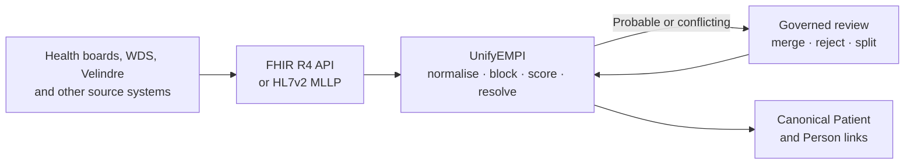

import { Badge, Card, CardGrid, LinkCard } from '@astrojs/starlight/components';

	<Badge text="FHIR R4" variant="success" />
	<Badge text="HL7v2 ADT" variant="note" />
	<Badge text="Multi-tenant" variant="tip" />
	<Badge text="Demo live" variant="success" />

UnifyEMPI links source Patient records into governed enterprise identities while
preserving source provenance. Matching decisions remain bounded, explainable and
reviewable.

:::caution[Engineering foundation]
UnifyEMPI is not a certified clinical product. Use only synthetic data in demos.
Production NHS use requires independent clinical-safety, privacy, security, operational
and contractual assurance.
:::

## Choose your route

<CardGrid>
	<Card title="Run it" icon="rocket">
		Bring up the API, operations portal and HL7v2 listener with the
		[ten-minute quick start](/UnifyEMPI/getting-started/).
	</Card>
	<Card title="Understand it" icon="open-book">
		Start with the [identity model](/UnifyEMPI/concepts/identity-model/) and the
		[NHS Wales source model](/UnifyEMPI/concepts/nhs-wales-sources/).
	</Card>
	<Card title="Tune matching" icon="setting">
		Read the normative [matching and blocking rules](/UnifyEMPI/matching/rules/) before
		changing candidate discovery, weights or thresholds.
	</Card>
	<Card title="Integrate existing FHIR" icon="open-book">
		Use the [existing FHIR integration guide](/UnifyEMPI/integration/existing-fhir/overview/)
		to design a side-by-side store, bootstrap and synchronisation path.
	</Card>
	<Card title="Operate it" icon="approve-check">
		Use the [configuration reference](/UnifyEMPI/reference/configuration/) and
		[production-readiness guide](/UnifyEMPI/governance/production-readiness/).
	</Card>
</CardGrid>

## What the platform owns

Source systems remain authoritative for their own Patient snapshots. UnifyEMPI owns
enterprise UUIDv7 identities, links, candidate indexes, canonical views, review cases,
receipts and audit evidence.

	<LinkCard
		title="View implementation"
		description="Browse the UnifyEMPI repository on GitHub."
		href="https://github.com/Lumbridge/UnifyEMPI"
	/>
	<LinkCard
		title="Inspect FHIR capabilities"
		description="Open the live demo API CapabilityStatement."
		href="https://unifyempi-demo-api-mjpwolhr6q-nw.a.run.app/fhir/R4/metadata"
	/>

