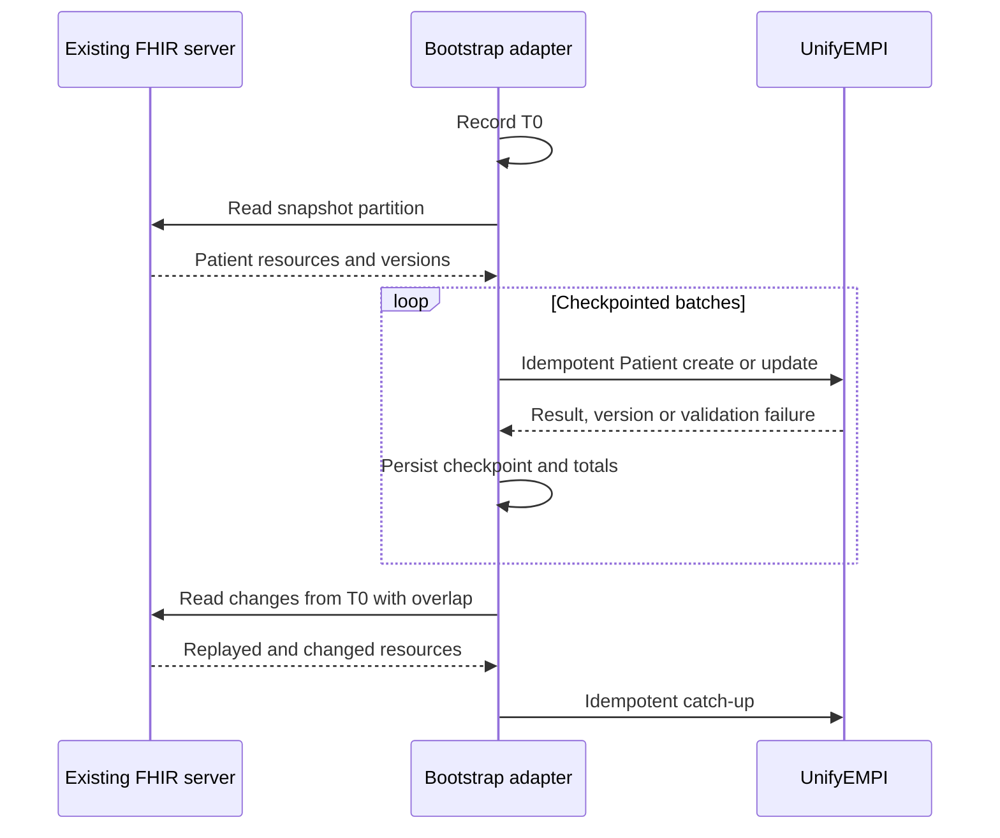

Treat a multi-million-Patient bootstrap as a migration programme. Do not copy raw
resources directly into the UnifyEMPI store: direct copies bypass tenant/source
labelling, validation, normalisation, idempotency, matching and audit controls.

## Choose the loading path

### Built-in external-FHIR reconciliation

The maintenance worker can read an external R4 `Patient` search, follow paging links
and submit every result through the normal registry service. It is durable and
resumable, but maintenance batches are limited to 25 records and Patients in each page
are ingested individually.

Use it for:

- representative trials;
- bounded catch-up windows;
- normal scheduled incremental synchronisation; and
- sources whose volume and response times have been proven acceptable.

Do not assume it is suitable for an initial load of several million Patients without a
representative throughput test and an acceptable completion-time calculation.

### Purpose-built bulk adapter

For a large initial snapshot, build a resumable adapter that reads from the existing
server's supported bulk/export boundary and writes through UnifyEMPI's normal FHIR
ingestion API.

The adapter should:

- authenticate as exactly one tenant and source system;
- preserve the source-local Patient ID;
- generate a stable idempotency key from source, resource ID and source version;
- preserve a payload digest for replay checking;
- checkpoint independently partitioned work;
- bound concurrency to the source and UnifyEMPI rate limits;
- quarantine permanent validation failures without stopping unrelated partitions;
- retry transient failures with jittered backoff; and
- emit aggregate counts without Patient values.

UnifyEMPI does not currently ship this bulk adapter. FHIR Bulk Data, database export or
cloud-native transfer can be used upstream if available, but every resulting Patient
must still cross the governed ingestion boundary.

## Capture a stable snapshot

Before the snapshot starts, record a high-water instant `T0` from an agreed clock.



Use an overlap before `T0` when the source timestamp or indexing boundary is not
perfectly precise. Idempotency receipts should make safe replays unchanged rather than
creating another source record.

## Partition safely

Choose partitions that the source can reproduce, such as:

- organisation or source namespace;
- stable identifier range;
- source-supported export partition;
- `meta.lastUpdated` window with a deterministic secondary key; or
- an upstream immutable snapshot manifest.

Avoid page-number checkpoints against a live mutable search result. Persist the source
cursor only when the server defines it as opaque and resumable, and never construct or
rewrite the server's next-page URL.

Each checkpoint should record:

```text
run ID
source system
partition
snapshot or change window
last committed cursor or key
read count
created count
updated count
unchanged replay count
validation-failure count
transient-retry count
payload-manifest digest
```

Do not store Patient values in migration logs.

## Use the API ingestion contract

A bulk adapter writing FHIR uses:

```text
POST /fhir/R4/Patient
Authorization: Bearer <source service token>
Scope: system/Patient.write
Claims: one tenant_id and one source_system
Idempotency-Key: <stable source/resource/version key>
```

On create, `Patient.id` is treated as the source-local ID when supplied. Updates use
the UnifyEMPI resource ID returned by create and require its current weak `ETag` in
`If-Match`. Keep an encrypted mapping from source key to returned resource ID and ETag,
or use the built-in external reader when the adapter cannot maintain that state.

Never submit UnifyEMPI-managed tenant labels, enterprise IDs, verified/authoritative
identifier extensions or blocking tags as client overrides. Authority is derived from
the governed tenant/source configuration and approved identity tags.

## Dry-run stages

Use progressively larger gates:

1. **Synthetic contract test** — invented Patients covering every mapping rule.
2. **Representative sample** — approved records spanning sources, quality patterns and
   expected duplicates.
3. **Volume rehearsal** — enough records to exercise paging, rate limits, candidate
   breadth, store quotas and restart recovery.
4. **Full shadow backfill** — complete population in a non-production or production-grade
   shadow store with no production consumers.
5. **Incremental catch-up** — replay changes from `T0` until lag meets the approved
   objective.

Resetting the test store between early rehearsals is usually safer than trying to
manually remove a partial identity graph. Full-volume tests should use a documented
teardown and retention procedure.

## Completion checks

Before validation:

- every expected partition is complete;
- source totals reconcile with imported, unchanged and quarantined totals;
- no source key maps to more than one UnifyEMPI source record;
- failed records have owners and replay decisions;
- the change feed has caught up without a time gap;
- blocking candidate truncation remains within the accepted envelope; and
- backup, restore and bootstrap restart have been demonstrated.

Next: configure
[ongoing synchronisation](/UnifyEMPI/integration/existing-fhir/synchronisation/) and
complete
[validation and cut-over](/UnifyEMPI/integration/existing-fhir/validation-and-cutover/).
