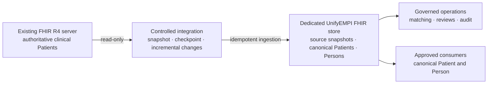

Use a dedicated UnifyEMPI FHIR store beside the existing clinical store. Treat the
existing server as an authoritative, read-only upstream source and let UnifyEMPI own
its source snapshots, enterprise identities, review workflow and operational evidence
in a separate store.

:::caution[Do not point UnifyEMPI at an arbitrary populated store]
Changing `GcpHealthcare:StoreName` to an existing clinical store does not onboard its
Patients. Those resources do not carry UnifyEMPI's tenant labels, source roles,
enterprise links, logical versions, blocking tags or idempotency receipts. Mixing
product-owned and externally owned resources also makes permissions, rollback and
retention difficult to govern.
:::

## Recommended topology



The integration is deliberately one-way at this boundary. UnifyEMPI does not edit the
upstream Patient during import and does not write merge decisions back into the source
store automatically. Any downstream notification or source-system correction needs a
separately governed interface.

## What each side owns

| Existing server or store | Dedicated UnifyEMPI store |
| --- | --- |
| Original `Patient` resources and source history | Source Patient snapshots identified by tenant, source and local ID |
| Source-specific business rules and corrections | Enterprise UUIDv7 identities and canonical Patients |
| Source authentication and access policy | `Person` links and redirect state |
| Upstream provenance and traced-identifier evidence | Blocking keys and matching-profile versions |
| Source deletion or replacement events | Review `Task` resources, decisions and audit evidence |
| Clinical record beyond the identity snapshot | Ingestion receipts and durable maintenance jobs |

UnifyEMPI is an identity-resolution layer, not a replacement clinical record. Import
only the identity and provenance data approved for matching and survivorship.

## Supported integration shapes

| Shape | Best use | Important limitation |
| --- | --- | --- |
| Normal FHIR writes to UnifyEMPI | Ongoing source events where the producer can call the UnifyEMPI API | Requires a trusted tenant/source service identity and replay-safe client |
| External FHIR reconciliation reader | Incremental catch-up from an R4 `Patient` search endpoint | Bounded maintenance batches are not a high-throughput bulk-import endpoint |
| Purpose-built bulk adapter | Initial onboarding of hundreds of thousands or millions of Patients | The deployment must build and operate the adapter; UnifyEMPI does not currently ship a bulk loader |
| HL7v2 ADT feed | Ongoing events from systems that publish ADT identity changes | MLLP should remain private and protected with mutual TLS |

A common programme uses a bulk adapter for the initial snapshot, then changes to normal
FHIR or HL7v2 events. Scheduled external-FHIR reconciliation provides catch-up and
population assurance rather than replacing the live feed.

## A second store for testing

A second FHIR store is the preferred test boundary. For early work, use a representative
synthetic or de-identified population. Full-volume identifiable testing requires the
same information-governance, access, retention, monitoring and incident controls as a
production service.

Strongest isolation is:

```text
Production source project
  Existing clinical FHIR store (read-only to the integration)

Non-production MPI project
  Dedicated UnifyEMPI test store
  Test API and operations portal
  Separate service accounts, HMAC secrets, logs and budgets
```

Creating the second store in the same Healthcare dataset is technically possible, but
a separate project normally gives clearer IAM, quota, billing, audit and
accidental-write isolation. Do not share blocking HMAC secrets between test and
production.

## Integration journey

1. Complete the
   [source readiness assessment](/UnifyEMPI/integration/existing-fhir/readiness/).
2. Design and test the
   [initial bootstrap](/UnifyEMPI/integration/existing-fhir/bootstrap/).
3. Configure
   [ongoing synchronisation](/UnifyEMPI/integration/existing-fhir/synchronisation/).
4. Complete
   [validation and cut-over](/UnifyEMPI/integration/existing-fhir/validation-and-cutover/).
5. Use the [maintenance runbook](/UnifyEMPI/guides/maintenance/) for re-indexing and
   population reconciliation after onboarding.
