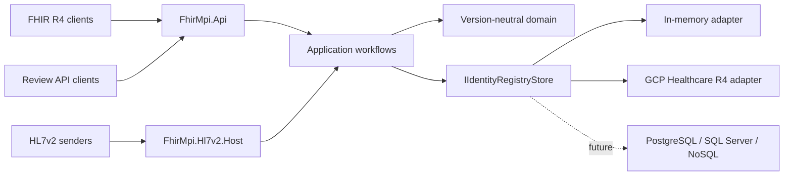

# Architecture

For the implemented request, message and governance sequences, see
[core paths and processing model](core-paths.md).
For operational terminology, national tenancy choices and common questions, see
[concepts and frequently asked questions](concepts-and-faq.md).

## Dependency rule

The domain contains tenant IDs, source records, enterprise clusters, normalised identity values, match evidence, review cases, decisions, and audit records. It has no Firely, HTTP, GCP, SQL, or HL7 dependencies.

The application implements ingestion, blocking, matching, survivorship, linking, review, and merge workflows. Protocol adapters translate into application commands. Persistence adapters translate `IIdentityRegistryStore` mutations into provider-native atomic operations.

FHIR R4 is isolated in `FhirMpi.Fhir.R4`; an R5 adapter can be added beside it without changing domain or persistence contracts.

## Registry materialisation

Each cluster is materialised as:

- source `Patient` resources with authoritative snapshots;
- one `Person` with source links and assurance;
- one read-optimised canonical `Patient`;
- `Task` review cases;
- immutable `AuditEvent` evidence;
- private `Basic` idempotency receipts.

Candidate lookup uses only versioned HMAC blocking tags. No matching workflow may scan the Patient population.

The canonical Patient is a server-managed enterprise view, not a replacement for its
authoritative source records. Source Patients do not carry blocking tags. New-source
ingestion and user-initiated duplicate checks generate temporary keys from the incoming
or selected profile, then search the stored tags on canonical Patients. This keeps one
candidate per enterprise identity rather than returning every linked source record.

## Match safety

The evidence engine weights family name 0.25, given names 0.20, birth date 0.30, address/postcode 0.15, telecom 0.07, and gender 0.03. Missing fields produce no evidence. `possible` starts at 0.62 and `probable` at 0.82. `certain` requires a verified authoritative exact identifier with no authoritative identifier or birth-date conflict.

Only certain matches auto-link. Probable matches create review cases. A conflicting valid NHS number is a hard stop.

Identifier verification is server-controlled. Wire-level FHIR extensions are treated as untrusted; only identifiers from a tenant-configured authoritative source are persisted as verified/authoritative. A valid authoritative-system identifier supplied to `$match` may establish certainty only when the stored candidate was verified by such a source.

## Tenant boundary

Tenant and source identity come only from validated JWT claims or the configured MLLP listener/certificate binding. Headers, resource extensions, URLs, and MSH fields cannot override them.

No query, match or review crosses a tenant boundary. A deployment intended to resolve
identities nationally therefore normally models participating record owners as source
systems within one national tenant. Separate regional tenants require a separate
federation or national-linking design.

The GCP adapter adds defence in depth:

1. mandatory tenant `meta.security`;
2. tenant-bound strict search construction;
3. self-link verification after searches;
4. label verification after reads;
5. same-tenant validation for every transaction resource;
6. no unscoped GCP client outside the adapter.
